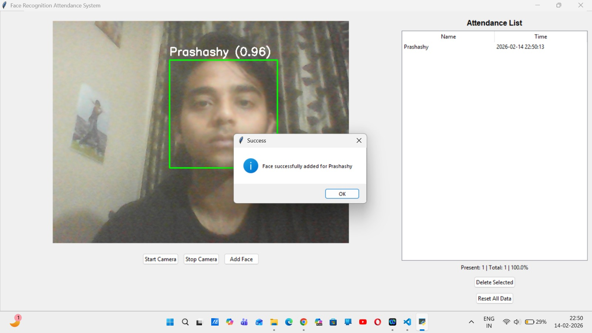
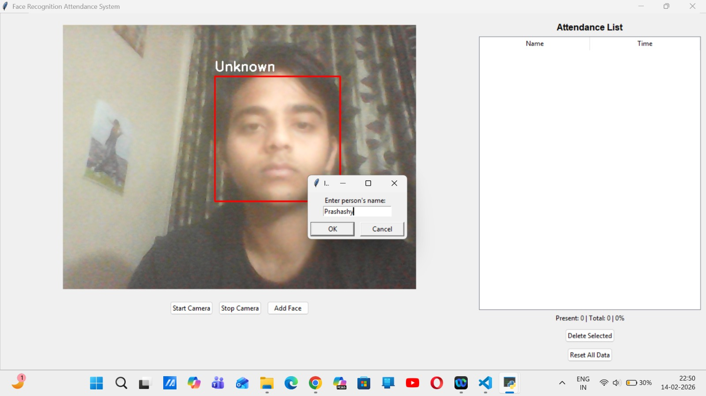

# Smart Attendance using Facial Recognition System

A comprehensive Face Recognition Attendance System built with Python, OpenCV, and Tkinter. This application allows for real-time face detection, registration, and attendance tracking with an intuitive GUI.

## Features

-   **Real-time Face Recognition**: Detects and recognizes faces using webcam feed.
-   **User Registration**: Easily add new users by capturing their face directly from the application.
-   **Attendance Tracking**: Automatically marks attendance with date and time when a registered face is recognized.
-   **CSV Export**: Attendance records are saved in `attendance.csv` for easy export and viewing.
-   **Data Management**:
    -   Delete individual attendance records.
    -   Reset all facial data and attendance records with a single click.
-   **Desktop Shortcut**: Includes a script to create a convenient desktop shortcut.

## Prerequisites

-   Python 3.x
-   Webcam

## Installation

1.  **Clone the repository:**
    ```bash
    git clone https://github.com/ps-hash/face-recognition.git
    cd face-recognition
    ```

2.  **Install dependencies:**
    ```bash
    pip install -r requirements.txt
    ```

## Usage

1.  **Run the application:**
    ```bash
    python main.py
    ```
    *Alternatively, if you created the desktop shortcut, just double-click "FaceAttendance" on your desktop.*

2.  **Register a User:**
    -   Click **"Start Camera"**.
    -   Click **"Add Face"**.
    -   Follow the prompt to enter the user's name.
    -   The system will capture and save the face data.

3.  **Mark Attendance:**
    -   Start the camera.
    -   Look at the camera.
    -   When recognized, the system will display the name and mark attendance in the list.

4.  **Manage Records:**
    -   Select a record in the list and click **"Delete Selected"** to remove it.
    -   Click **"Reset All Data"** to clear all known faces and attendance logs (Warning: cannot be undone).

## Project Structure

-   `main.py`: Main entry point and GUI implementation.
-   `utils/face_utils.py`: Core logic for face detection, recognition, and attendance management.
-   `requirements.txt`: List of Python dependencies.
-   `known faces/`: Directory storing registered face images.
-   `attendance.csv`: Log file for attendance records.
-   `create_shortcut.ps1`: PowerShell script to create a desktop shortcut.

## Technologies Used

-   **Python**: Core programming language.
-   **OpenCV**: Computer vision library for face detection and image processing.
-   **Tkinter**: Standard GUI framework for Python.
-   **Pillow (PIL)**: Python Imaging Library for image handling in the GUI.
-   **NumPy**: Numerical computing library for array operations.

. VIDEO TUTORIAL https://www.youtube.com/watch?v=BT4WzyT2g8k
## Screenshots






